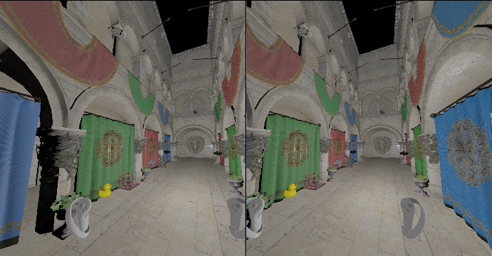

# XRLib
This is a personal library aimed at accelerating the development of XR applications without the use of a traditional game engine. The library is built using Vulkan and OpenXR.

This project is currently in the very early stages of development and is subject to significant changes. As this is an ongoing personal project, stability and feature completeness cannot be guaranteed at this time.

This library is not suitable for large model loading and is not optimized for handling large meshes.




## Implementation Overview
**Completed features**:
- screen space and vr rendering
- basic PBR and phong illumination
- controller binding "/khr/simple_controller"

**WIP**:
- more controller profiles (Quest, Pico)
- multiple render passes
- xr mirror view

## Usage
```
include(FetchContent)

FetchContent_Declare(
    XRLib
    GIT_REPOSITORY https://github.com/AoGao-Kedoka/XRLib_Renderer.git
    GIT_TAG main
)

FetchContent_MakeAvailable(XRLib)

target_link_libraries(YOUR_TARGET PRIVATE XRLib::XRLib)
```

**Note**:

It's **recommended** to pre-install the dependencies via vcpkg, otherwise it will cause very long compile time for the first time:
```
vcpkg install openxr-loader vulkan glm glfw3 shaderc assimp fmt
```
Then build your project via:
```
cmake .. -DCMAKE_TOOLCHAIN_FILE=<path_to_vcpkg>/scripts/buildsystems/vcpkg.cmake
```

## References
- https://openxr-tutorial.com//windows/vulkan/index.html
- https://amini-allight.org/post/openxr-tutorial-part-0
